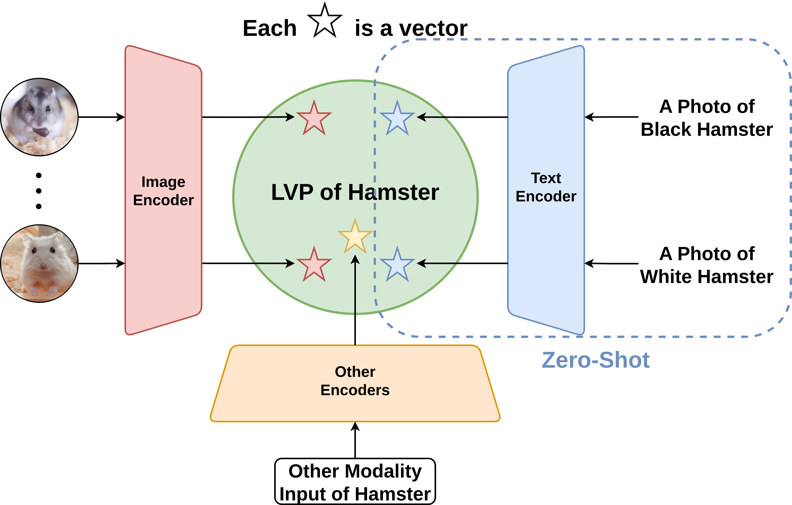
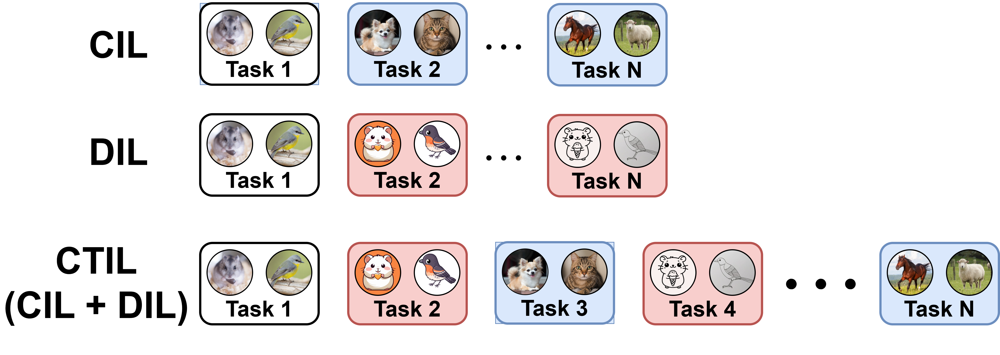

# LVP-CLIP: Revisiting CLIP for Continual Learning with Label Vector Pool 🚀 [[Paper (CVF Open Access)](https://openaccess.thecvf.com/content/CVPR2025W/MULA2025/html/Ma_LVP-CLIP_Revisiting_CLIP_for_Continual_Learning_with_Label_Vector_Pool_CVPRW_2025_paper.html)] [[PDF]](https://openaccess.thecvf.com/content/CVPR2025W/MULA2025/papers/Ma_LVP-CLIP_Revisiting_CLIP_for_Continual_Learning_with_Label_Vector_Pool_CVPRW_2025_paper.pdf)

### Authors

Yue Ma, Huantao Ren, Boyu Wang, Jingang Jin, Senem Velipasalar, Qinru Qiu

---

We use the official CLIP model provided by OpenAI (https://github.com/openai/CLIP), which is included locally for convenience.

## Proposed Method

### The Concept of Label Vector Pool (LVP)
The core idea of **LVP** is to leverage the rich feature space of CLIP by directly using **visual embeddings** from training samples as class prototypes, rather than relying on potentially noisy or inadequate text embeddings. Furthermore, the **LVP** concept is not limited to the CLIP model; it can be effectively applied to **any other pre-trained model** with a robust feature extractor.



### LVP-T(Text-Only)

The label vector is generated exclusively from the text embedding, known as zero-shot.

### LVP-I(Image-Only)

The Label Vector Pool is formed exclusively using the image embeddings derived from the training samples. This minimizes dependency on text prompts entirely.

We can use the **mean of the training image embeddings** to represent each class because the features of each class often follow a **Gaussian (normal) distribution** in the high-dimensional feature space.


### LVP-IT(Image + Text)

The class vector in the pool is generated as a combination of both image and text embeddings, leveraging the robustness of both modalities.

### LVP-C

This variant employs a standard linear classifier trained directly on the features consolidated within the LVP, using the pool's information to define the classification boundary.

### Method Overview


### Cross-Task Incremental Learning(CTIL)

Our proposed CTIL is a combination of CIL and DIL that allows for learning tasks in sequences, regardless of the task type.



## Key Contributions

* **Introduction of Label Vector Pool (LVP):** A novel approach that uses the high-dimensional features of training images as similarity references, moving away from text-based labels in CLIP-based continual learning.
* **Enhanced Stability and Efficiency:** LVP learning algorithms are **task-order invariant** and result in **minimum catastrophic forgetting** because new knowledge does not modify the old knowledge. Tasks can be learned independently and in parallel with low computational and memory demands.
* **State-of-the-Art Performance:** Our proposed LVP-based methods significantly **outperform the current state-of-the-art baseline by a margin of 40.7%** on Cross-Task Incremental Learning(CTIL) tasks.

---

## Installation

```base
# Clone the repository
git clone https://github.com/mayueanyou/LVP-CLIP.git
cd LVP-CLIP

# Create a conda environment (optional but recommended)
conda create -n lvp_clip python=3.10
conda activate lvp_clip

# Install dependencies
pip install -r requirements.txt
```

## Run The Demo on CIFAR100

Any function could use the -m to select the models, by default is **5** which is the **ViT-B/16**

```
# Convert the CIFAR100 dataset to image embeddings(use ViT-B/16)
python3 main.py -f cifar100_generate_image_embedings

# Convert the CIFAR100 dataset to image embeddings(use ViT-L/14@336px )
python3 main.py -f cifar100_generate_image_embedings -m 8

```


```
# Convert the CIFAR100 dataset to image embeddings
#(This will save your time as we don't need to convert everytime)
python3 main.py -f cifar100_generate_image_embedings

# Generate the LVP-I for CIFAR100
python3 main.py -f cifar100_generate_lvp_i

# Generate the LVP-T for CIFAR100(zero-shot)
python3 main.py -f cifar100_generate_lvp_t

# Generate the LVP-IT for CIFAR100
python3 main.py -f cifar100_generate_lvp_it

# Generate the LVP-C for CIFAR100
python3 main.py -f cifar100_generate_lvp_c

# Evalue the Performace of LVP-I for CIFAR100
python3 main.py -f cifar100_eval_lvp -lvp i

# Evalue the Performace of LVP-T for CIFAR100
python3 main.py -f cifar100_eval_lvp -lvp t

# Evalue the Performace of LVP-IT for CIFAR100
python3 main.py -f cifar100_eval_lvp -lvp it

# Evalue the Performace of LVP-C for CIFAR100
python3 main.py -f cifar100_eval_lvp_c

```

## Result for CIFAR100

The provided code excludes the Continual Learning settings, which simplifies both reading and execution.
All the results below were produced by running this repository.
The results for LVP-IT and LVP-C could be higher because I did not grid search the optimal hyperparameters.

| Model Name | RN50 | RN101 | RN50x4 | RN50x16 | RN50x64 | ViT-B/16 | ViT-B/32 | ViT-L/14 | ViT-L/14@336px |
|:---:|:---:|:---:|:---:|:---:|:---:|:---:|:---:|:---:|:---:|
| model_sel | 0 | 1 | 2 | 3 | 4 | 5 | 6 | 7 | 8 |
| LVP-T(zero-shot)  | 0 | 1 | 2 | 3 | 4 | 64.79 | 61.68 | 73.30 | 72.00 |
| LVP-I  | 0 | 1 | 2 | 3 | 4 | 70.01 | 66.06 | 80.08 | 79.37 |
| LVP-IT | 0 | 1 | 2 | 3 | 4 | 73.15 | 70.11 | 81.87 | 81.00 |
| LVP-C  | 0 | 1 | 2 | 3 | 4 | 71.20 | 66.56 | 80.24 | 79.37 |

## Citation

If you find this work useful for your research, please cite our paper:

```
@InProceedings{Ma_2025_CVPR,
    author    = {Ma, Yue and Ren, Huantao and Wang, Boyu and Jin, Jingang and Velipasalar, Senem and Qiu, Qinru},
    title     = {LVP-CLIP: Revisiting CLIP for Continual Learning with Label Vector Pool},
    booktitle = {Proceedings of the IEEE/CVF Conference on Computer Vision and Pattern Recognition (CVPR) Workshops},
    month     = {June},
    year      = {2025},
    pages     = {231-240}
}
```
